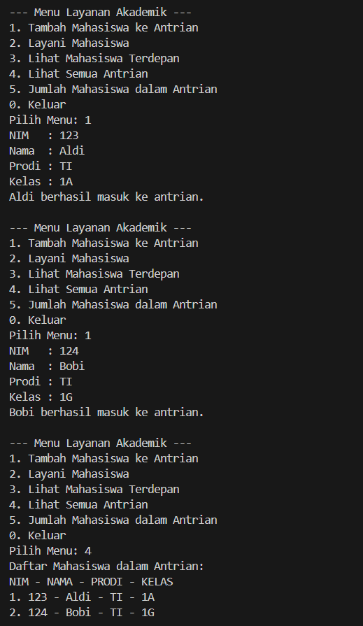

|  | Algorithm and Data Structure |
|--|--|
| NIM |  244107020212|
| Nama |  Naufal Abid Aurizky |
| Kelas | TI - 1H |
| Repository | [link] (https://github.com/Abidau/Algoritma-Struktur-Data/tree/main/Week10) |

# QUEUE


## 2.1 Percobaan 1 : Operasi Dasar Queue

Hasil Kode Program 


### 2.1.3. Pertanyaan

1. Nilai awal front dan rear diatur ke -1 untuk menunjukkan bahwa queue masih kosong. Ini berarti tidak ada elemen yang telah ditambahkan ke dalam queue. Atribut size diatur ke 0 karena tidak ada elemen yang ada di dalam queue pada saat inisialisasi.

2. Potongan kode dalam method Enqueue bertujuan untuk menambahkan elemen baru ke dalam queue. Jika queue tidak penuh, elemen baru akan ditambahkan pada posisi rear, dan rear akan diperbarui untuk menunjuk ke posisi berikutnya. Jika ini adalah elemen pertama yang ditambahkan, front juga akan diatur ke 0.

3. Potongan kode dalam method Dequeue digunakan untuk menghapus elemen dari posisi front dalam queue. Jika queue tidak kosong, elemen pada posisi front akan diambil dan front akan diperbarui untuk menunjuk ke elemen berikutnya. Jika queue menjadi kosong setelah penghapusan, front dan rear akan diatur kembali ke -1.

4. Variabel i dimulai dari front karena kita ingin mencetak elemen-elemen yang ada dalam queue mulai dari posisi depan hingga posisi belakang. Memulai dari 0 tidak akan memberikan hasil yang benar jika queue tidak dimulai dari indeks 0.

5. Potongan kode dalam method print bertujuan untuk menampilkan semua elemen dalam queue dari posisi front hingga rear. Ini memastikan bahwa semua elemen yang ada dalam queue ditampilkan dengan urutan yang benar.

6. Potongan kode yang menunjukkan queue overflow biasanya terdapat dalam method Enqueue, di mana sebelum menambahkan elemen baru, kita memeriksa apakah queue sudah penuh dengan menggunakan method isFull(). Jika isFull() mengembalikan true, maka itu adalah kondisi overflow.

7. Modifikasi dapat dilakukan dengan menambahkan pernyataan System.exit(0); setelah menampilkan pesan kesalahan untuk queue overflow dan underflow. Ini akan menghentikan eksekusi program jika kondisi tersebut terjadi.

## 2.2. Percobaan 2 : Antrian Layanan Akademik

Hasil Kode Program 




### 2.2.3 Pertanyaan

1. Untuk menambahkan method LihatAkhir pada class AntrianLayanan, kita perlu membuat method baru yang akan mengembalikan elemen yang berada di posisi belakang antrian. Method ini bisa terlihat seperti ini:

```
     public Mahasiswa LihatAkhir() {
         if (isEmpty()) {
             System.out.println("Antrian kosong!");
             return null;
         }
         return data[rear]; // Mengembalikan elemen di posisi belakang
     }
```

Setelah itu, kita perlu memperbarui class LayananAkademikSIAKAD untuk menambahkan opsi menu baru. Misalnya, kita bisa menambahkan pilihan di menu yang memungkinkan pengguna untuk memanggil method LihatAkhir. Contoh penambahan menu bisa seperti ini:

```
     System.out.println("6. Cek Antrian paling belakang");
```

Kemudian, dalam switch-case yang menangani pilihan menu, kita tambahkan case untuk pilihan 6 yang akan memanggil method LihatAkhir:
```
     case 6:
         Mahasiswa terakhir = antrian.LihatAkhir();
         if (terakhir != null) {
             System.out.println("Mahasiswa di belakang antrian: " + terakhir.nama);
         }
         break;
```

## 2.3 Tugas


