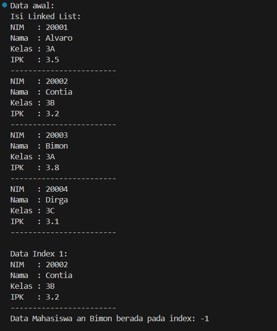
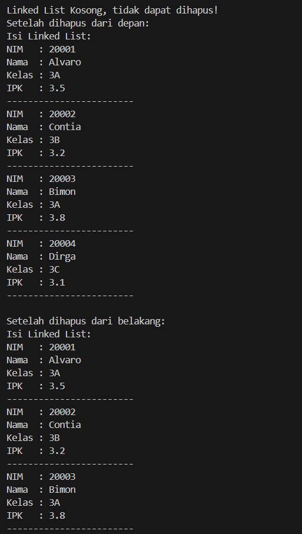
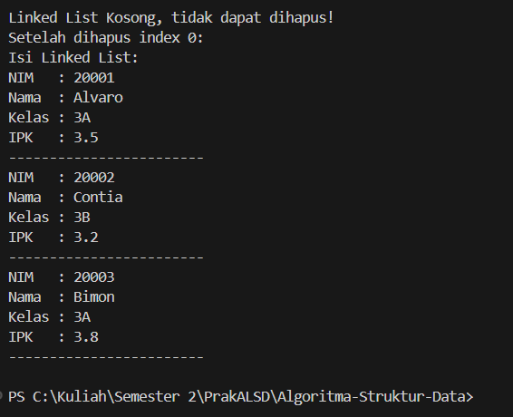

|  | Algorithm and Data Structure |
|--|--|
| NIM |  244107020212|
| Nama |  Naufal Abid Aurizky |
| Kelas | TI - 1H |
| Repository | [link] (https://github.com/Abidau/Algoritma-Struktur-Data/tree/main/Week11) |

# LINKED LIST


## 2.1 Pembuatan Single Linked List

Hasil Kode Program 


### 2.1.2 Pertanyaan

1. Karena belum ada data yang ditambahkan ke linked list, jadi isinya masih kosong waktu pertama kali dicetak.

2. temp dipakai untuk membantu mengecek atau menjalani data di dalam linked list, jadi tidak merubah posisi awal (head). Semacam penunjuk sementara saja.

3. Berikut adalah Modifikasi Kode Program agar dapar ditambahkan dari keyboard

```
import java.util.Scanner;

public class SLLMain20 {
    public static void main(String[] args) {
        Scanner sc = new Scanner(System.in);
        SingleLinkedList20 data = new SingleLinkedList20();

        System.out.print("Masukkan NIM   : ");
        String nim = sc.nextLine();
        System.out.print("Masukkan Nama  : ");
        String nama = sc.nextLine();
        System.out.print("Masukkan Kelas : ");
        String kelas = sc.nextLine();
        System.out.print("Masukkan IPK   : ");
        double ipk = sc.nextDouble();

        Mahasiswa20 mhsBaru = new Mahasiswa20(nim, nama, kelas, ipk);
        data.addFirst(mhsBaru);
        data.print();
    }
}

```

## 2.2 Modifikasi Elemen pada Single Linked List

Hasil Kode Program 







### 2.2.3 Pertanyaan

1. break digunakan untuk perulangan berhenti setelah data yang dicari bertemu dan berhasil dihapus, jadi program tidak melanjut mencari cari ke node berikutnya yang sebenarnya suda tidak perlu dicek.

2. kode tersebut digunakan untuk mengecek jika node yang dihapus ternyata node terakhir (tail). Jika iya, Tail harus dipindahkan ke node sebelumnya (temp) agar penanda akhir list tetap benar. 

## 3. Tugas

