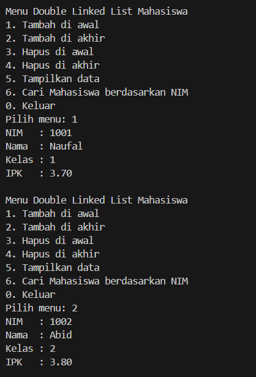
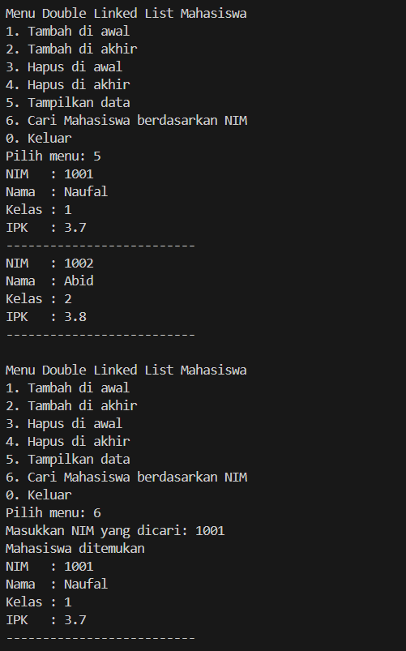
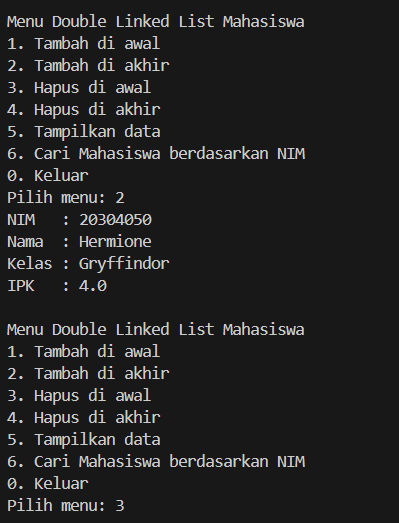
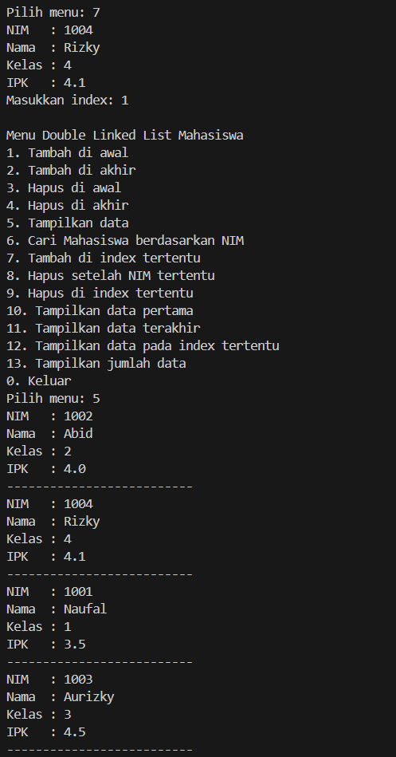

|  | Algorithm and Data Structure |
|--|--|
| NIM |  244107020212|
| Nama |  Naufal Abid Aurizky |
| Kelas | TI - 1H |
| Repository | [link] (https://github.com/Abidau/Algoritma-Struktur-Data/tree/main/Week12) |

# Double Linked Lists


## 12.2 Kegiatan Praktikum 1

Hasil Kode Program 





### 12.2.3 Pertanyaan Percobaan

1. Single Linked List hanya punya pointer next, jadi hanya bisa ditelusuri maju. Double Linked List punya next dan prev, jadi bisa ditelusuri dua arah (maju dan mundur).

2. next menunjuk node setelahnya, prev menunjuk node sebelumnya. Digunakan agar data bisa ditelusuri dua arah.

3. Untuk menginisialisasi head dan tail menjadi null, artinya linked list masih kosong saat pertama dibuat.

4. Kode ini menghubungkan node baru ke depan dari node yang sudah ada, lalu update head supaya menunjuk ke node baru.

5. Untuk menghubungkan node yang sebelumnya menjadi node kedua dengan node baru yang sekarang jadi head.

6. Tambahkan pengecekan di awal method print() seperti:
```
if (isEmpty()) {
    System.out.println("Linked list kosong.");
}
```

7. Agar node setelah current menghubungkan prev-nya ke newNode, jadi rantai dua arah tetap tersambung.

8. Pertama, tambahkan opsi baru pada menu utama di main:
```
System.out.println("7. Tambah data setelah NIM tertentu");
```
Kedua, tambahkan case 7 di dalam switch-case:
```
case 7: {
    System.out.print("Masukkan NIM yang dicari: ");
    String keyNim = sc.nextLine();

    Mahasiswa01 mhs = inputMahasiswa(sc);
    list.insertAfter(keyNim, mhs);
    break;
}
```
Tujuannya agar user bisa memilih tambah data setelah NIM tertentu langsung dari menu, dan method insertAfter() dapat dipanggil sesuai input pengguna.

## 12.3 Kegiatan Praktikum 2

Hasil Kode Program 



### 12.3.3 Pertanyaan Percobaan

1. Baris pertama memindahkan head ke node berikutnya (menghapus node paling depan), Baris kedua memutus hubungan node baru dengan node sebelumnya agar tidak terhubung lagi ke node yang dihapus.

2. Simpan data node yang akan dihapus ke variabel sebelum dihapus, lalu tampilkan setelah penghapusan. Contohnya:
```
if (!isEmpty()) {
    Mahasiswa01 mhs = head.data;
    head = head.next;
    if (head != null) head.prev = null;
    System.out.println("Data sudah berhasil dihapus. Data yang terhapus adalah:");
    mhs.tampil();
}

```

## 12.5 Tugas Praktikum

Hasil Kode Program 

