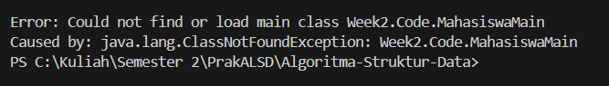
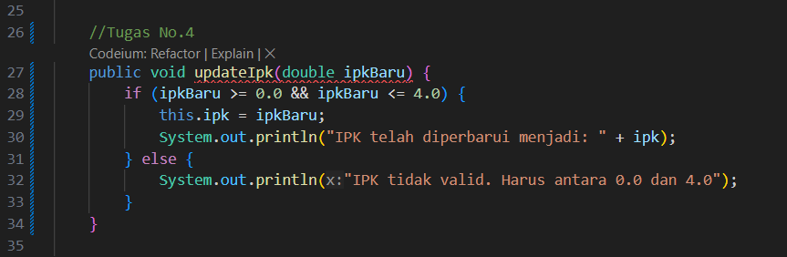
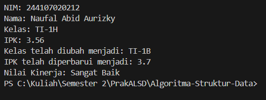
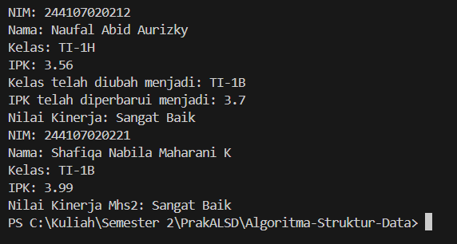
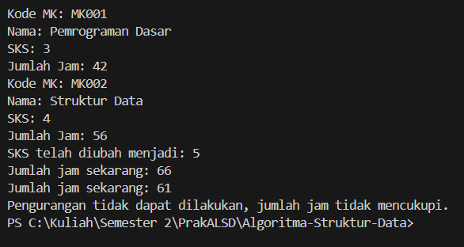
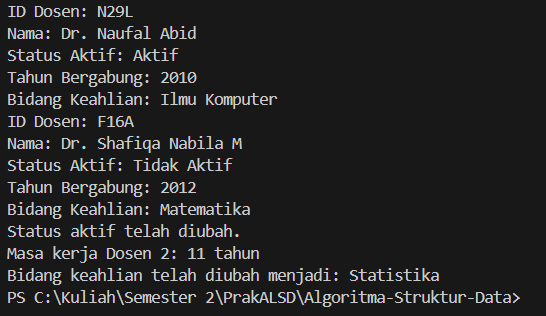

|  | Algorithm and Data Structure |
|--|--|
| NIM |  244107020212|
| Nama |  Naufal Abid Aurizky |
| Kelas | TI - 1H |
| Repository | [link] () |

# OBJECT
 
## 2.1 Percobaan 1: Deklarasi Class, Atribut dan Method

Hasil Kode Program

### 2.1.3 Pertanyaan

1. dua karakteristik class atau object
- Encapsulation (Enkapsulasi)

        Enkapsulasi adalah konsep yang menyembunyikan detail implementasi dari suatu class dan hanya menampilkan interface yang diperlukan. Ini memungkinkan pengendalian akses ke atribut dan method, sehingga data tidak dapat diubah secara langsung dari luar class.

- Inheritance (Pewarisan)

        Pewarisan adalah kemampuan untuk membuat class baru yang mewarisi atribut dan method dari class yang sudah ada. Ini memungkinkan penggunaan kembali kode dan menciptakan hierarki class yang lebih terstruktur.

2. Jumlah Atribut ada 4, yaitu

    - nim: String
    - nama: String
    - kelas: String
    - ipk: double

3. Jumlah Method ada 5, yaitu

    - tampilkanInformasi(): void
    - ubahKelas(kelasBaru: String): void
    - updateIpk(ipkBaru: double): void
    - nilaiKinerja(ipk: double): String
    - (Konstruktor default dan konstruktor berparameter juga dapat dianggap sebagai method, tetapi biasanya tidak dihitung dalam konteks ini.)

4. 

5. Jawaban 

- Cara Kerja Method nilaiKinerja()

    - Method nilaiKinerja(double ipk) menerima parameter ipk yang merupakan nilai Indeks Prestasi Kumulatif (IPK) mahasiswa.

    - Di dalam method ini, terdapat beberapa kondisi yang memeriksa nilai IPK yang diberikan :

        - Jika ipk lebih besar atau sama dengan 3.5, maka method akan mengembalikan string "Sangat Baik".

        - Jika ipk lebih besar atau sama dengan 3.0 tetapi kurang dari 3.5, maka method akan mengembalikan string "Baik".

        - Jika ipk lebih besar atau sama dengan 2.0 tetapi kurang dari 3.0, maka method akan mengembalikan string "Cukup".
        
        - Jika ipk kurang dari 2.0, maka method akan mengembalikan string "Kurang".
    
- Kriteria yang Digunakan

    - Sangat Baik: IPK >= 3.5
    - Baik: 3.0 <= IPK < 3.5
    - Cukup: 2.0 <= IPK < 3.0
    - Kurang: IPK < 2.0
   
- Nilai Kembali (Return Value):

    - Method nilaiKinerja() mengembalikan (return) sebuah string yang menunjukkan kategori kinerja mahasiswa berdasarkan nilai IPK yang diberikan.

## 2.2 Percobaan 2: Instansiasi Object, serta Mengakses Atribut dan Method

Hasil Kode Program

### 2.2.3 Pertanyaan

1. Jawaban

Baris Kode untuk Proses Instansiasi

    Mahasiswa mhs1 = new Mahasiswa();

Nama Objek yang Dihasilkan

    mhs1

2. Jawaban

- Cara Mengakses Atribut:

    - Atribut dari suatu objek dapat diakses dengan menggunakan notasi titik (.). Contoh :

            mhs1.nim = "244107020212";
            System.out.println(mhs1.nama);

- Cara Mengakses Method:

    - Method dari suatu objek juga dapat diakses dengan menggunakan notasi titik (.). Contoh :

            mhs1.tampilkanInformasi();

3. Pada pemanggilan pertama, method tampilkanInformasi() dipanggil untuk objek mhs1, yang telah diisi dengan data atribut (NIM, nama, kelas, dan IPK). sedangkan Pada pemanggilan kedua, method tampilkanInformasi() dipanggil untuk objek mhs2, yang diinstansiasi menggunakan konstruktor berparameter dengan data yang berbeda (NIM, nama, kelas, dan IPK yang berbeda dari mhs1). Oleh karena itu, output yang dihasilkan akan mencerminkan data yang berbeda untuk masing-masing objek.

## 2.3 Percobaan 3: Membuat Konstruktor

Hasil Kode Program

### 2.3.3 Pertanyaan

1. Jawaban

        public Mahasiswa(String nim, String nama, String kelas, double ipk) {
        this.nim = nim;
        this.nama = nama;
        this.kelas = kelas;
        this.ipk = ipk;
        }

    Baris kode di atas mendeklarasikan konstruktor berparameter untuk class Mahasiswa. Konstruktor ini menerima empat parameter nim, nama, kelas, dan ipk, yang digunakan untuk menginisialisasi atribut dari objek Mahasiswa.

2. Baris program di atas melakukan instansiasi objek baru dari class Mahasiswa dengan menggunakan konstruktor berparameter. Dalam hal ini, objek mhs2 diinisialisasi dengan nilai-nilai berikut :

        nim: "244107020221"
        nama: "Shafiqa Nabila Maharani K"
        kelas: "TI-1B"
        ipk: 3.99

    Dengan demikian, objek mhs2 sekarang memiliki atribut yang diisi dengan data yang diberikan melalui konstruktor.

3. Jika konstruktor default dihapus dan program dijalankan, maka akan terjadi kesalahan kompilasi (compile-time error) ketika mencoba untuk membuat objek mhs1 menggunakan konstruktor default :

        Mahasiswa mhs1 = new Mahasiswa(); // Ini akan menyebabkan error

    Ketika konstruktor default dihapus, Java tidak lagi menyediakan konstruktor tanpa parameter untuk class Mahasiswa. Oleh karena itu, jika ada kode yang mencoba untuk membuat objek Mahasiswa tanpa memberikan argumen (seperti new Mahasiswa()), maka akan terjadi kesalahan kompilasi.

4. Tidak, method di dalam class Mahasiswa tidak harus diakses secara berurutan. memanggil method dalam urutan apa pun sesuai kebutuhan logika program. Misalnya, memanggil method tampilkanInformasi() sebelum atau setelah memanggil method updateIpk(), tergantung pada apa yang diinginkan. jika suatu method bergantung pada hasil dari method lain (misalnya, jika ingin menampilkan informasi setelah memperbarui IPK), maka harus memanggilnya dalam urutan yang sesuai untuk mendapatkan hasil yang diinginkan.

5. Untuk membuat objek baru dengan nama mhs<NamaMahasiswa>, Anda dapat mengganti <NamaMahasiswa> dengan nama mahasiswa yang diinginkan. Contoh Kode : 

        // Membuat objek baru dengan nama Abidau menggunakan konstruktor berparameter
        Mahasiswa Abidau = new Mahasiswa("244107020212", "Naufal Abid Aurizky", "TI-1H", 3.56);

        // Mengakses method untuk objek Abidau
        Abidau.tampilkanInformasi();

## 2.4 Latihan Praktikum

Hasil Kode Program dari Latihan Praktikum Matakuliah

Hasil kode program dari Latihan Praktikum Dosen 

