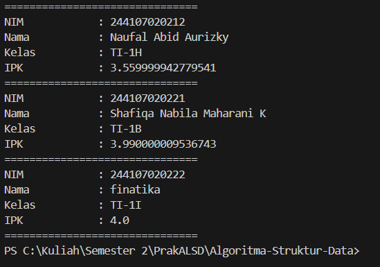
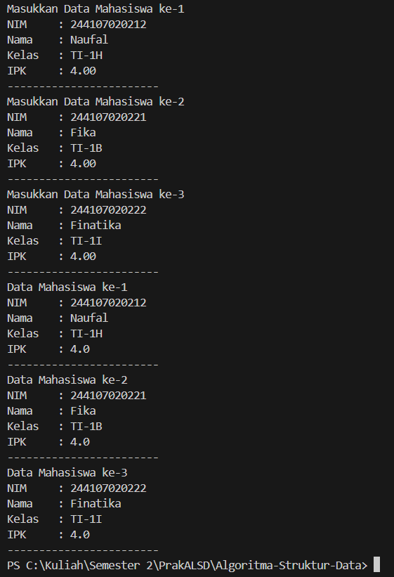
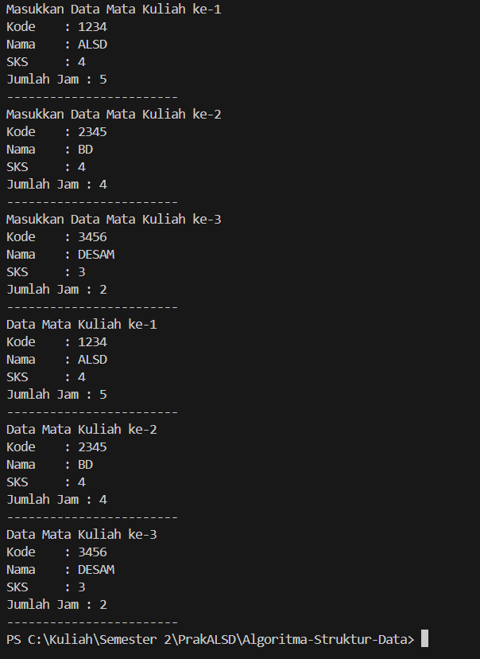
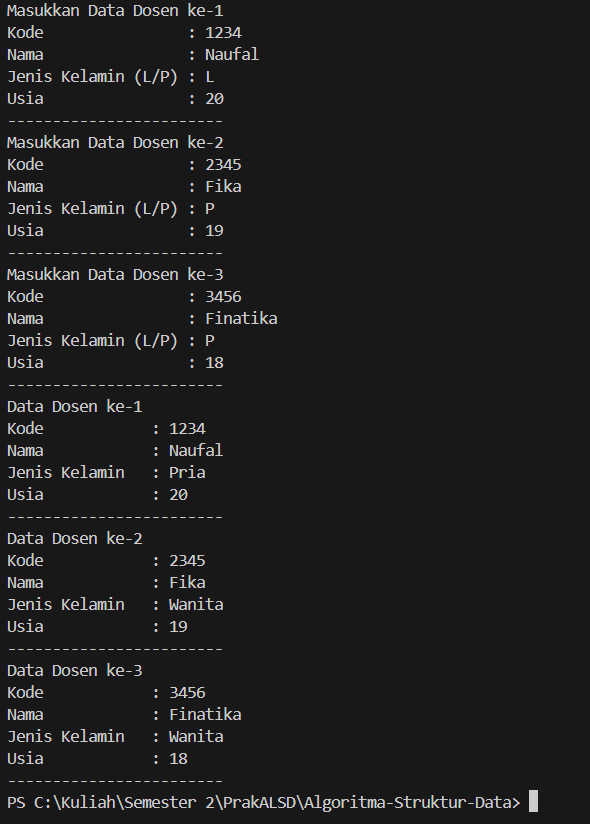
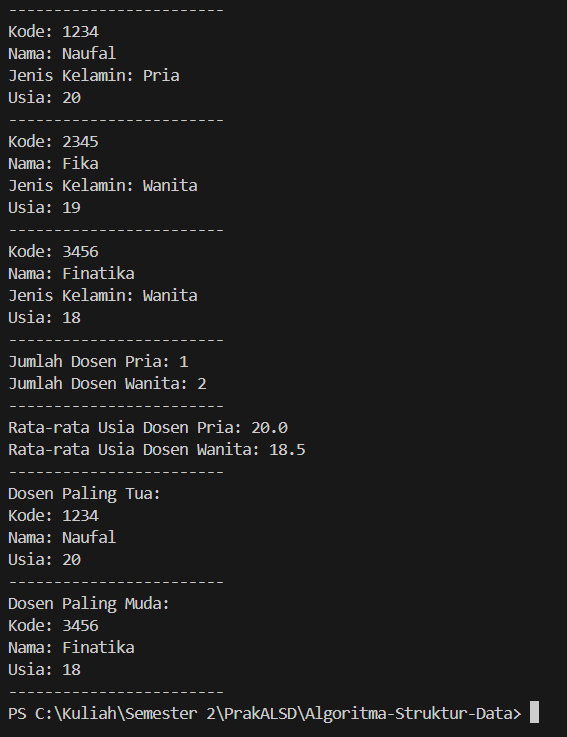

|  | Algorithm and Data Structure |
|--|--|
| NIM |  244107020212|
| Nama |  Naufal Abid Aurizky |
| Kelas | TI - 1H |
| Repository | [link] (https://github.com/Abidau/Algoritma-Struktur-Data/tree/main/Week3) |

# ARRAY OF OBJECTS

## 3.2 Membuat Array dari Object, Mengisi dan Menampilkan

Hasil Kode Program 

### 3.2.3 Pertanyaan

1. Tidak harus. Sebuah class bisa saja hanya memiliki atribut tanpa method, atau hanya memiliki method tanpa atribut. biasanya class yang dibuat untuk array of objects memiliki atribut untuk menyimpan data dan method untuk melakukan sesuatu dengan data tersebut. Atribut membantu kita menyimpan informasi, sedangkan method membantu kita mengolah atau menampilkan informasi itu.

2. kode ini akan membuat objek dari class yang sudah kita buat, mengisi data ke dalam objek tersebut, dan dapat menampilkan informasi ke layar. Kode ini biasanya digunakan untuk menunjukkan bagaimana cara menggunakan array of objects.

3. Jika class Mahasiswa tidak memiliki konstruktor yang kita buat sendiri, Java secara otomatis memberikan konstruktor default yang tidak memerlukan parameter. Jadi, kita bisa memanggil konstruktor ini tanpa masalah. Jika ada konstruktor yang kita buat dengan parameter, kita harus memanggilnya dengan memberikan nilai yang sesuai.

4. Kode program ini membuat sebuah array yang berisi tiga objek dari class Mahasiswa. Setiap objek diisi dengan informasi seperti NIM, nama, kelas, dan IPK. Setelah semua data diisi, program ini mencetak informasi masing-masing mahasiswa ke layar dengan format yang rapi. Jadi, kita bisa melihat detail dari setiap mahasiswa, seperti NIM, nama, kelas, dan IPK mereka, dengan pemisah garis di antara setiap mahasiswa agar tampilannya lebih jelas. Ini adalah contoh yang baik tentang bagaimana cara menggunakan array of objects dalam Java untuk menyimpan dan menampilkan data.

5. Class Mahasiswa dan Mahasiswa Demo dipisahkan untuk membuat kode lebih teratur dan mudah dipahami. Class Mahasiswa berfungsi untuk mendefinisikan data dan perilaku yang berkaitan dengan mahasiswa, seperti atribut NIM, nama, kelas, dan IPK. Sementara itu, class Mahasiswa Demo digunakan untuk menjalankan program dan menguji class Mahasiswa.

## 3.3 Menerima Input Isian Array Menggunakan Looping

Hasil Kode Pemrograman

### 3.3.3 Pertanyaan

1. Jawaban

Kode class Mahasiswa

.png)

Kode class MahasiswaDemoo

.png)

2. Jika mencoba menggunakan array myArrayOfMahasiswa tanpa menginisialisasinya terlebih dahulu, maka kode tersebut akan menyebabkan error karena tidak dapat mengakses elemen dari array yang belum dibuat. Jadi, jika kita menulis myArrayOfMahasiswa[0] tanpa mendeklarasikan dan menginisialisasi myArrayOfMahasiswa dengan ukuran tertentu, program akan memberikan error karena tidak ada objek yang dapat diakses di dalam array tersebut. Pastikan untuk selalu menginisialisasi array sebelum menggunakannya.

## 3.4 Constructor Berparameter

Hasil Kode Pemrograman

### 3.4.3 Pertanyaan

1. Ya, sebuah class dapat memiliki lebih dari satu constructor, yang dikenal sebagai constructor overloading. Ini memungkinkan untuk membuat objek dari class tersebut dengan cara yang berbeda, tergantung pada parameter yang kita berikan.

2. Jawaban

Kode class Matakuliah

.png)

Kode class MatakuliahDemo

.png)

3.  Jawaban

kode class Matakuliah

.png)

Kode class MatakuliahDemo

.png)

4. Jawaban

Kode class MatakuliahDemo (code dengan nama MatakuliahDemoMod.java)

.png)

Hasil Output dari code class MatakuliahDemo

.png)

## 3.5 Tugas

1. Hasil Kode Pemrograman 

2. Hasil Kode Pemrograman

