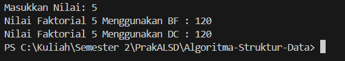
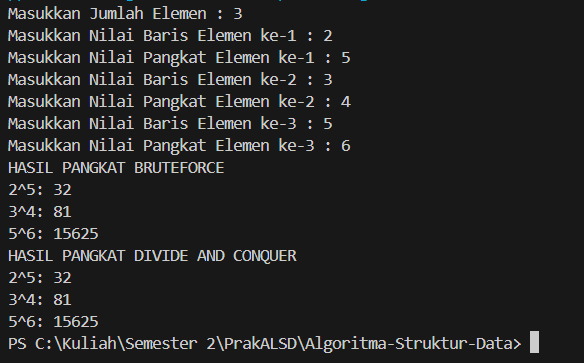
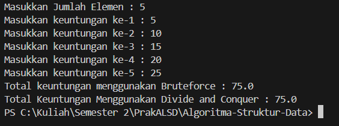
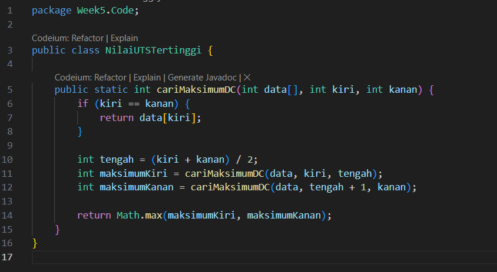
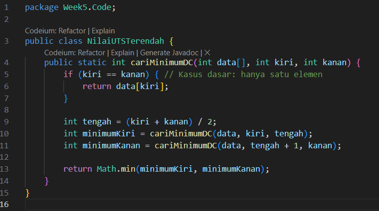
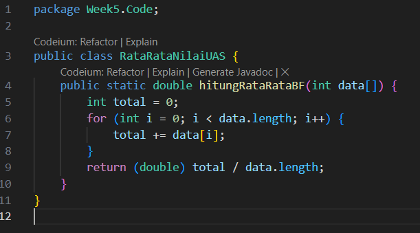
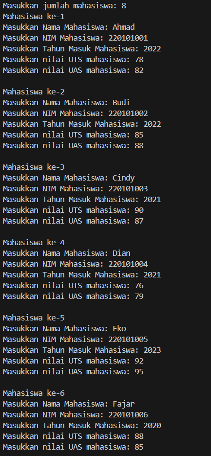
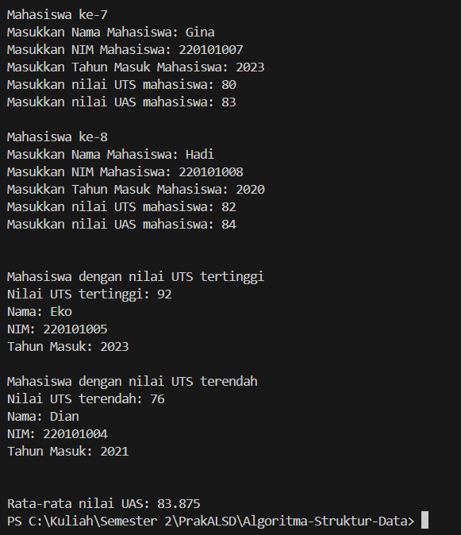

|  | Algorithm and Data Structure |
|--|--|
| NIM |  244107020212|
| Nama |  Naufal Abid Aurizky |
| Kelas | TI - 1H |
| Repository | [link] (https://github.com/Abidau/Algoritma-Struktur-Data/tree/main/Week5) |

# BRUTE FORCE DAN DIVIDE CONQUER


## 5.2 Menghitung Nilai Faktorial dengan Algoritma Brute Force dan Divide and Conquer

Hasil Kode Program 



### 5.2.3. Pertanyaan

1. Perbedaan bagian kode pada penggunaan if dan else dalam algoritma Divide and Conquer untuk faktorial

- if (n == 0) return 1; → Ini adalah base case yang menghentikan rekursi dan mengembalikan nilai faktorial dari 0, yaitu 1.
- else return n * faktorialDC(n - 1); → Ini adalah recursive case yang memanggil dirinya sendiri dengan nilai n-1 hingga mencapai base case.

2. bisa menggunakan while atau rekursi, Contoh :
```
            public int faktorialBF(int n) {
        int fakto = 1;
        int i = 1;
            while (i <= n) {
            fakto *= i;
            i++;
        }
        return fakto;
        }
```

3. Perbedaan antara fakto *= i; dan int fakto = n * faktorialDC(n-1);

- fakto *= i; digunakan dalam iterasi (Brute Force), di mana faktorial dihitung dengan perkalian dalam loop.
- int fakto = n * faktorialDC(n-1); digunakan dalam rekursi (Divide and Conquer), di mana faktorial dihitung dengan memanggil dirinya sendiri sampai mencapai base case.

4. Kesimpulan tentang perbedaan faktorialBF() dan faktorialDC()

- faktorialBF() menggunakan pendekatan iteratif, lebih mudah dipahami tetapi membutuhkan lebih banyak operasi dalam loop.
- faktorialDC() menggunakan pendekatan rekursif, lebih efisien dalam konsep tetapi menggunakan lebih banyak memori karena pemanggilan rekursif.

## 5.3 Menghitung Hasil Pangkat dengan Algoritma Brute Force dan Divide and Conquer

Hasil Kode Program 



### 5.3.3. Pertanyaan

1. pangkatBF() menggunakan iterasi dengan kompleksitas O(n), sedangkan pangkatDC() menggunakan rekursi dengan kompleksitas O(log n), sehingga lebih efisien untuk pangkat besar.

2. tahap combine terjadi saat hasil dua rekursi dikalikan sebelum dikembalikan, Contoh :

```
    return (pangkatDC(a, n/2) * pangkatDC(a, n/2));
```

3. Metode pangkatBF(int a, int n) tetap relevan karena memberikan fleksibilitas dalam menghitung pangkat dari nilai lain tanpa mengandalkan atribut kelas. Namun, metode ini bisa dibuat tanpa parameter, cukup menggunakan atribut nilai dan pangkat dari objek. Contoh Metode tanpa parameter 

```
    public int pangkatBF() {
        int hasil = 1;
        for (int i = 0; i < pangkat; i++) {
            hasil *= nilai;
        }
        return hasil;
    }
```

4. pangkatDC() lebih efisien dibandingkan pangkatBF(), terutama untuk pangkat besar karena memiliki kompleksitas O(log n) dibandingkan O(n) pada brute force.


## 5.4 Menghitung Sum Array dengan Algoritma Brute Force dan Divide and Conquer

Hasil Kode Program 



### 5.4.3. Pertanyaan

1. mid digunakan untuk membagi array menjadi dua bagian agar bisa dihitung secara rekursif dengan metode Divide and Conquer.

2. digunakan untuk menghitung total dari bagian kiri (lsum) dan kanan (rsum) secara rekursif sebelum digabungkan.

3. Base case terjadi saat hanya ada satu elemen (l == r), sehingga langsung dikembalikan nilainya tanpa rekursi lebih lanjut.

4. totalDC() membagi array menjadi dua bagian, menghitung jumlah masing-masing bagian secara rekursif, lalu menggabungkan hasilnya, membuatnya lebih efisien dibandingkan iterasi pada data besar.

## 4.5 Latihan Praktikum

a) Nilau UTS tertinggi tertinggi menggunakan Divide and Conquer



b) Nilai UTS terendah menggunakan Divide and Conquer



c) Rata-rata nilai UAS dari semua mahasiswa menggunakan Brute Force



Main Code 


