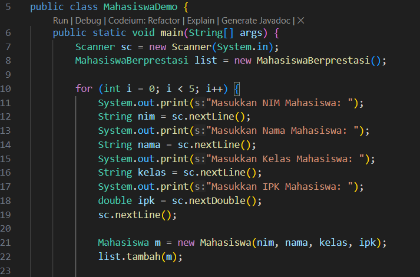
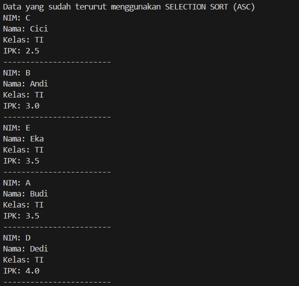

|  | Algorithm and Data Structure |
|--|--|
| NIM |  244107020212|
| Nama |  Naufal Abid Aurizky |
| Kelas | TI - 1H |
| Repository | [link] (https://github.com/Abidau/Algoritma-Struktur-Data/tree/main/Week6) |

# SORTING (BUBBLE, SELECTION, DAN INSERTION SORT)


## 5.2 Praktikum 1 - Mengimplementasikan Sorting menggunakan object

Hasil Kode Program 


### 5.2.5 Pertanyaan!

1. Kode ini digunakan untuk mengurutkan data, seperti angka atau nama, dalam urutan tertentu (misalnya dari yang terkecil ke yang terbesar).

2. Kode Program Pencarian Nilai Minimum pada Selection Sort
```
void selectionSort(int[] arr) {
    for (int i = 0; i < arr.length - 1; i++) {
        int minIndex = i;
        for (int j = i + 1; j < arr.length; j++) {
            if (arr[j] < arr[minIndex]) {
                minIndex = j;
            }
        }
        int temp = arr[minIndex];
        arr[minIndex] = arr[i];
        arr[i] = temp;
    }
}
```

3. Kondisi dalam perulangan digunakan untuk membandingkan elemen yang sedang diproses dengan elemen sebelumnya yang sudah terurut, dan memindahkannya ke posisi yang benar jika lebih kecil.

4. Tujuan perintah dalam Insertion Sort adalah untuk menyisipkan elemen yang sedang diproses ke posisi yang tepat dalam bagian yang sudah terurut.

## 5.3 Praktikum 2- (Sorting Menggunakan Array of Object) 

Hasil Kode Program 


### Sorting DESC


### 5.3.4 Pertanyaan

1. A) Agar tidak melebihi batas array, karena membandingkan elemen saat ini dengan elemen berikutnya.

   B) Untuk menghindari perbandingan dengan elemen yang sudah terurut di akhir array.

   c) Perulangan i akan berlangsung 49 kali, dan ada 49 tahap bubble sort yang ditempuh untuk mengurutkan 50 elemen.

2. Kode Program 



### Sorting SelectionSort



### 5.3.7 Pertanyaan

1. Mencari Elemen Terkecil

        int minIndex = i; 
        
    mengasumsikan elemen pertama dari bagian yang belum terurut adalah yang terkecil.
        
        if (lisMhs[j].ipk < lisMhs[minIndex].ipk) 
        
    membandingkan elemen berikutnya dengan elemen terkecil yang ditemukan. Jika ada yang lebih kecil, minIndex diperbarui.

### Sorting InsertionSort


### 5.4.3 Pertanyaan

1. Kode Program


## 5.5 Latihan Praktikum

Hasil Kode Program 


