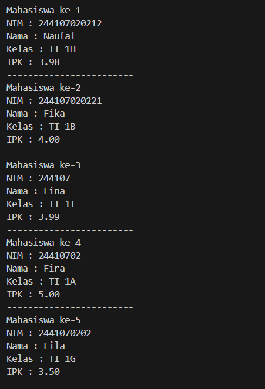
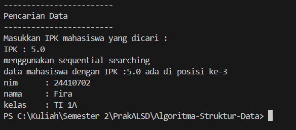
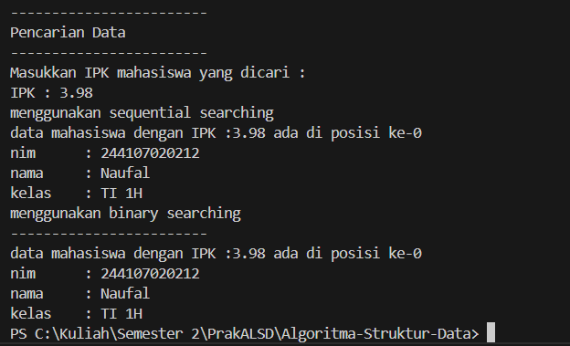
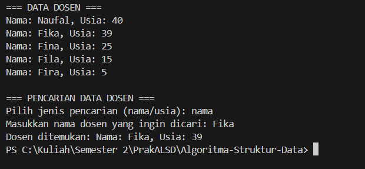

|  | Algorithm and Data Structure |
|--|--|
| NIM |  244107020212|
| Nama |  Naufal Abid Aurizky |
| Kelas | TI - 1H |
| Repository | [link] (https://github.com/Abidau/Algoritma-Struktur-Data/tree/main/Week7) |

# SEARCHING


## 6.2. Searching / Pencarian Menggunakan Agoritma Sequential Search

Hasil Kode Program 





### 6.2.3. Pertanyaan

1. Metode tampilDataSearch berfungsi untuk menampilkan informasi lengkap tentang mahasiswa yang ditemukan berdasarkan IPK yang dicari, termasuk NIM, nama, dan kelas, sedangkan metode tampilPosisi berfungsi untuk menunjukkan posisi dari mahasiswa yang dicari berdasarkan IPK dan menyatakan apakah data mahasiswa dengan IPK tertentu ditemukan atau tidak.

2. Fungsi break digunakan untuk menghentikan eksekusi loop segera ketika kondisi tertentu terpenuhi, sehingga program tidak melanjutkan pencarian lebih lanjut setelah menemukan hasil yang diinginkan.

## 6.3. Searching / Pencarian Menggunakan Binary Search

Hasil Kode Program 




### 6.3.3. Pertanyaan

1. Kode Program

```
mid = (right + left) / 2;
```

2. Kode Program

```
if (cari == listMhs[mid].ipk) {
    return mid;
} else if (listMhs[mid].ipk > cari) {
    return findBinarySearch(cari, left, mid - 1);
} else {
    return findBinarySearch(cari, mid + 1, right);
}
```

3. Tidak, program tidak akan berjalan dengan benar jika data IPK tidak urut. Binary search memerlukan data yang terurut untuk dapat membagi dan mencari dengan efektif. Jika data tidak terurut, hasil pencarian tidak dapat dijamin akurat.

4. Jika IPK yang dimasukkan dari yang terbesar ke terkecil (misalnya: 3.8, 3.7, 3.5, 3.4, 3.2) dan elemen yang dicari adalah 3.2, hasil dari binary search tidak akan sesuai. Program akan mencari di posisi yang salah karena asumsi bahwa data terurut tidak terpenuhi. Untuk memperbaiki ini, kode program binary search harus memastikan bahwa data diurutkan sebelum melakukan pencarian.

5. Kode Program

```
package Week7.Code;

import java.util.Scanner;

public class MahasiswaDemo1 {
    public static void main(String[] args) {
        MahasiswaBerprestasi1 list = new MahasiswaBerprestasi1();
        Scanner sc = new Scanner(System.in);

        System.out.print("Masukkan jumlah mahasiswa yang ingin ditambahkan: ");
        int jumMhs = sc.nextInt();
        sc.nextLine(); // Membersihkan buffer setelah nextInt()

        for (int i = 0; i < jumMhs; i++) {
            System.out.println("Mahasiswa ke-" + (i + 1));
            System.out.print("NIM : ");
            String nim = sc.nextLine();
            System.out.print("Nama : ");
            String nama = sc.nextLine();
            System.out.print("Kelas : ");
            String kelas = sc.nextLine();
            System.out.print("IPK : ");
            String ip = sc.nextLine();
            Double ipk = Double.parseDouble(ip);
            System.out.println("------------------------");
            list.tambah(new Mahasiswa(nim, nama, kelas, ipk));
        }

        list.tampil();
        System.out.println("------------------------");
        System.out.println("Pencarian Data");
        System.out.println("------------------------");
        System.out.print("Masukkan IPK mahasiswa yang dicari : ");
        double cari = sc.nextDouble();

        System.out.println("Menggunakan sequential searching");
        double posisi = list.sequentialSearching(cari);
        int pss = (int) posisi;
        list.tampilPosisi(cari, pss);
        list.tampilDataSearch(cari, pss);

        System.out.println("Menggunakan binary searching");
        System.out.println("------------------------");
        double posisi2 = list.findBinarySearch(cari, 0, list.idx - 1);
        int pss2 = (int) posisi2;
        list.tampilPosisi(cari, pss2);
        list.tampilDataSearch(cari, pss2);

        sc.close();
    }
}
```

## 6.5. Latihan Praktikum

Hasil Kode Program 

