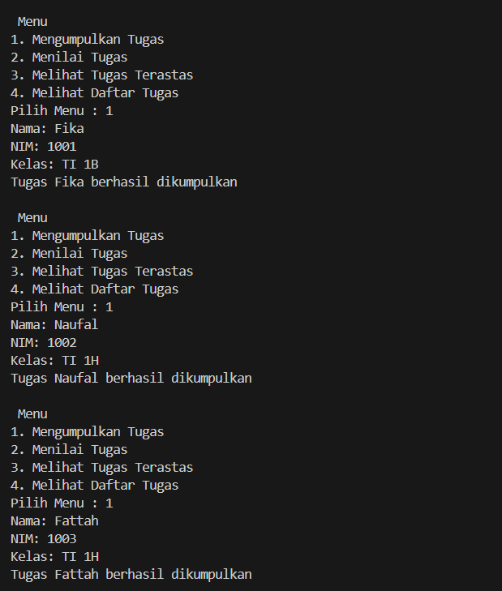
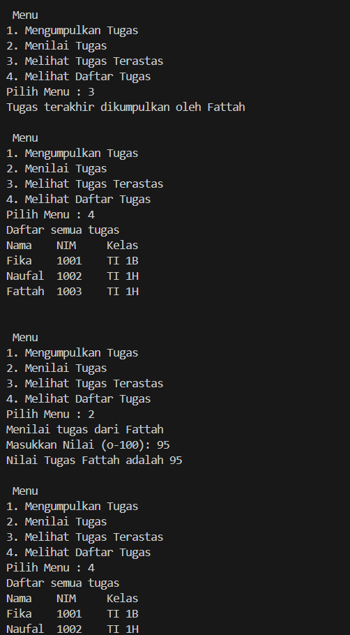
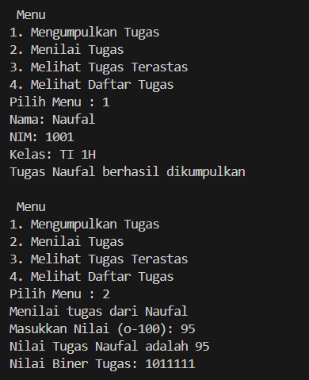
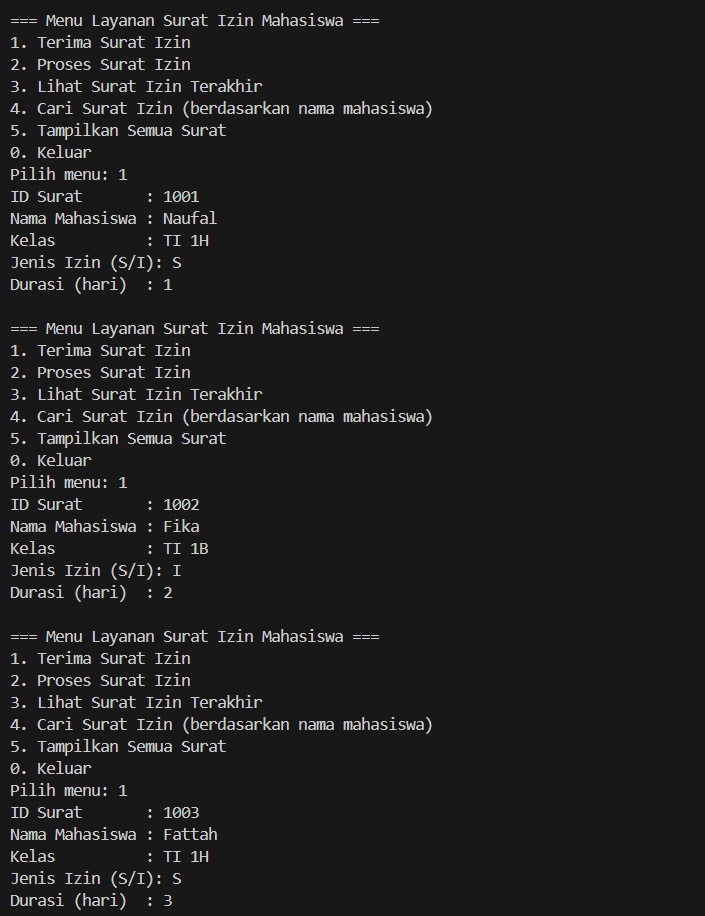
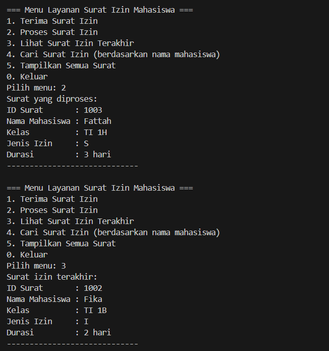
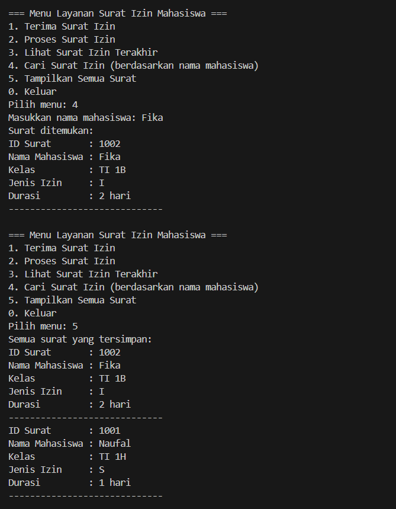

|  | Algorithm and Data Structure |
|--|--|
| NIM |  244107020212|
| Nama |  Naufal Abid Aurizky |
| Kelas | TI - 1H |
| Repository | [link] (https://github.com/Abidau/Algoritma-Struktur-Data/tree/main/Week9) |

# STACK


## 2.1 Percobaan 1: Mahasiswa Mengumpulkan Tugas

Hasil Kode Program 



!

### 2.1.3 Pertanyaan

1. Mahasiswa.java
```
public class Mahasiswa {
    String nim, nama, kelas;
    int nilai;

    public Mahasiswa(String nim, String nama, String kelas) {
        this.nim = nim;
        this.nama = nama;
        this.kelas = kelas;
        this.nilai = -1; // PERBAIKAN: memberi nilai default -1
    }

    public void tugasDinilai(int nilai) {
        this.nilai = nilai;
    }

    @Override
    public String toString() { // PERBAIKAN: override toString untuk output rapi
        return "NIM: " + nim + ", Nama: " + nama + ", Kelas: " + kelas + ", Nilai: " + 
               (nilai == -1 ? "Belum Dinilai" : nilai);
    }
}
```

StackTugasMahasiswa.java
```
public class StackTugasMahasiswa {
    Mahasiswa[] stack;
    int size;
    int top;

    public StackTugasMahasiswa(int size) {
        this.size = size;
        stack = new Mahasiswa[size];
        top = -1;
    }

    public boolean isFull() {
        return top == size - 1;
    }

    public boolean isEmpty() {
        return top == -1;
    }

    public void push(Mahasiswa mhs) {
        if (!isFull()) {
            top++;
            stack[top] = mhs;
            System.out.println("Tugas " + mhs.nama + " berhasil ditambahkan."); // PERBAIKAN: output tambahan
        } else {
            System.out.println("Stack penuh! Tidak dapat menambahkan tugas."); // PERBAIKAN
        }
    }

    public Mahasiswa pop() {
        if (!isEmpty()) {
            Mahasiswa mhs = stack[top];
            top--;
            System.out.println("Tugas " + mhs.nama + " dikeluarkan untuk dinilai."); // PERBAIKAN
            return mhs;
        } else {
            System.out.println("Stack kosong! Tidak ada tugas untuk dinilai."); // PERBAIKAN
            return null;
        }
    }

    public Mahasiswa peek() {
        if (!isEmpty()) {
            return stack[top];
        } else {
            return null;
        }
    }

    public void print() {
        if (isEmpty()) {
            System.out.println("Stack kosong."); // PERBAIKAN
        } else {
            System.out.println("Daftar tugas mahasiswa:"); // PERBAIKAN
            for (int i = top; i >= 0; i--) {
                System.out.println(stack[i]); // PERBAIKAN: gunakan toString()
            }
        }
    }
}
```

MahasiswaDemo.java
```
import java.util.Scanner;

public class MahasiswaDemo {
    public static void main(String[] args) {
        Scanner scan = new Scanner(System.in);
        StackTugasMahasiswa stack = new StackTugasMahasiswa(5); // PERBAIKAN: batas stack

        int pilih;

        do {
            System.out.println("\nMENU:");
            System.out.println("1. Tambah Tugas");
            System.out.println("2. Nilai Tugas (POP)");
            System.out.println("3. Lihat Tugas Teratas");
            System.out.println("4. Lihat Semua Tugas");
            System.out.println("0. Keluar");
            System.out.print("Pilih: ");
            pilih = scan.nextInt(); scan.nextLine(); // PERBAIKAN: input menu

            switch (pilih) {
                case 1:
                    System.out.print("NIM: ");
                    String nim = scan.nextLine();
                    System.out.print("Nama: ");
                    String nama = scan.nextLine();
                    System.out.print("Kelas: ");
                    String kelas = scan.nextLine();
                    Mahasiswa mhs = new Mahasiswa(nim, nama, kelas);
                    stack.push(mhs); // PERBAIKAN
                    break;

                case 2:
                    Mahasiswa dinilai = stack.pop();
                    if (dinilai != null) {
                        System.out.print("Masukkan nilai: ");
                        int nilai = scan.nextInt();
                        dinilai.tugasDinilai(nilai); // PERBAIKAN: berikan nilai
                        System.out.println("Tugas " + dinilai.nama + " telah dinilai."); // PERBAIKAN
                    }
                    break;

                case 3:
                    Mahasiswa atas = stack.peek();
                    if (atas != null)
                        System.out.println("Tugas Teratas: " + atas); // PERBAIKAN
                    else
                        System.out.println("Stack kosong."); // PERBAIKAN
                    break;

                case 4:
                    stack.print(); // PERBAIKAN
                    break;
            }
        } while (pilih != 0);

        scan.close();
    }
}
```

2. Kode Programnya

```
StackTugasMahasiswa stack = new StackTugasMahasiswa(5);
```

3. Pengecekan !isFull() mencegah penambahan elemen ke dalam stack jika stack sudah penuh. Jika if-else dihapus Akan terjadi ArrayIndexOutOfBoundsException saat mencoba menambahkan elemen ke array yang sudah penuh dan Program bisa crash/error saat runtime.

4. Tambahkan method baru pada StackTugasMahasiswa :

```
public Mahasiswa bottom() {
    if (!isEmpty()) {
        return stack[0];
    } else {
        return null;
    }
}
```

Tambahkan menu di MahasiswaDemo :

```
case 6:
    Mahasiswa bawah = stack.bottom();
    if (bawah != null) {
        System.out.println("Tugas terbawah:");
        System.out.println(bawah.nama + " - " + bawah.nim);
    } else {
        System.out.println("Stack masih kosong!");
    }
    break;
```

5. Method baru di StackTugasMahasiswa :

```
public int jumlahTugas() {
    return top + 1;
}
```

Tambahkan menu di MahasiswaDemo :

```
case 7:
    System.out.println("Jumlah tugas yang sudah dikumpulkan: " + stack.jumlahTugas());
    break;
```

## 2.2 Percobaan 2: Konversi Nilai Tugas ke Biner 

Hasil Kode Program 



### 2.2.3 Pertanyaan

1. Method konversiDesimalKeBiner bekerja dengan cara mengubah bilangan desimal menjadi bentuk biner menggunakan bantuan struktur data stack. Pertama, method ini membuat objek stack untuk menyimpan sisa pembagian dari bilangan desimal dengan angka 2. Selanjutnya, selama nilai desimal masih lebih besar dari 0, bilangan tersebut dibagi 2 secara berulang dan setiap sisa pembagian (hasil modulus) dimasukkan ke dalam stack. Proses ini akan menyimpan digit-digit biner dalam urutan terbalik karena sifat stack adalah Last In First Out (LIFO). Setelah proses pembagian selesai, isi stack dikeluarkan satu per satu untuk dicetak sehingga menghasilkan representasi bilangan dalam bentuk biner dengan urutan yang benar. Misalnya, jika input desimal adalah 10, maka hasil akhirnya adalah 1010.

2. Jika kondisi perulangan dalam method konversiDesimalKeBiner diubah menjadi while(kode != 0), secara umum hasil yang diperoleh tetap sama untuk semua bilangan desimal positif yang lebih besar dari nol. Namun, ketika input yang diberikan adalah nol (0), maka perulangan tidak akan dijalankan karena kondisi kode != 0 akan bernilai salah. Akibatnya, tidak ada angka yang dimasukkan ke dalam stack dan tidak ada output yang ditampilkan. Hal ini serupa dengan kondisi awal (kode > 0) karena kedua kondisi tersebut sama-sama tidak mengeksekusi perulangan jika input adalah 0. Oleh karena itu, meskipun kondisi diubah, tidak ada perbedaan hasil yang berarti, tetapi tetap disarankan untuk menambahkan pengecekan khusus agar jika input adalah nol, program tetap dapat menampilkan output “0” sebagai hasil konversi yang benar.

## 2.4 Latihan Praktikum

Hasil Kode Program 



!

!
